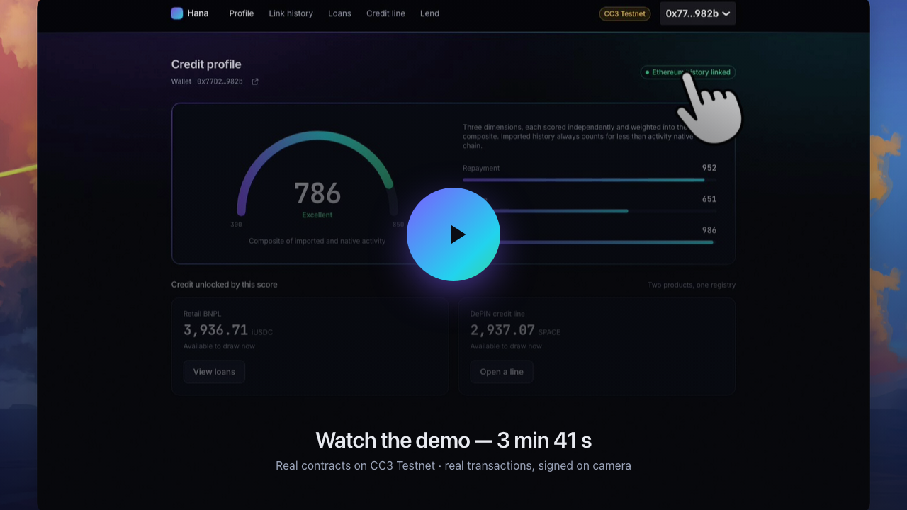
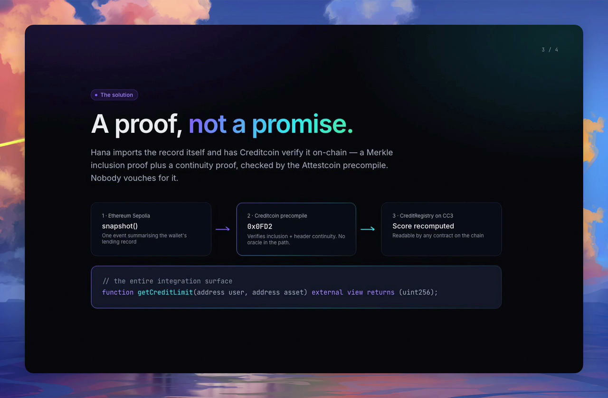
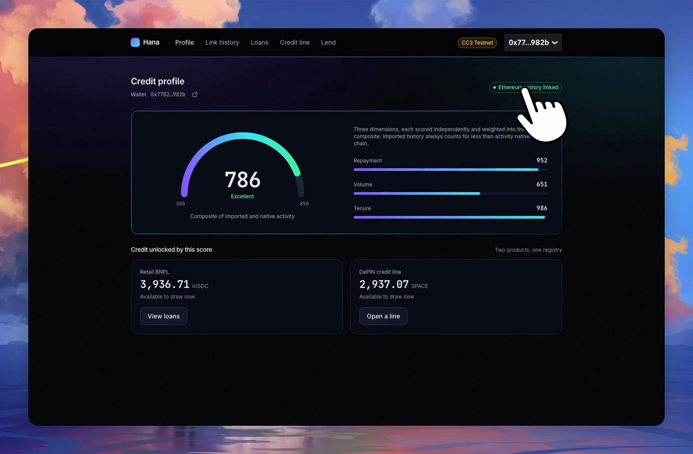
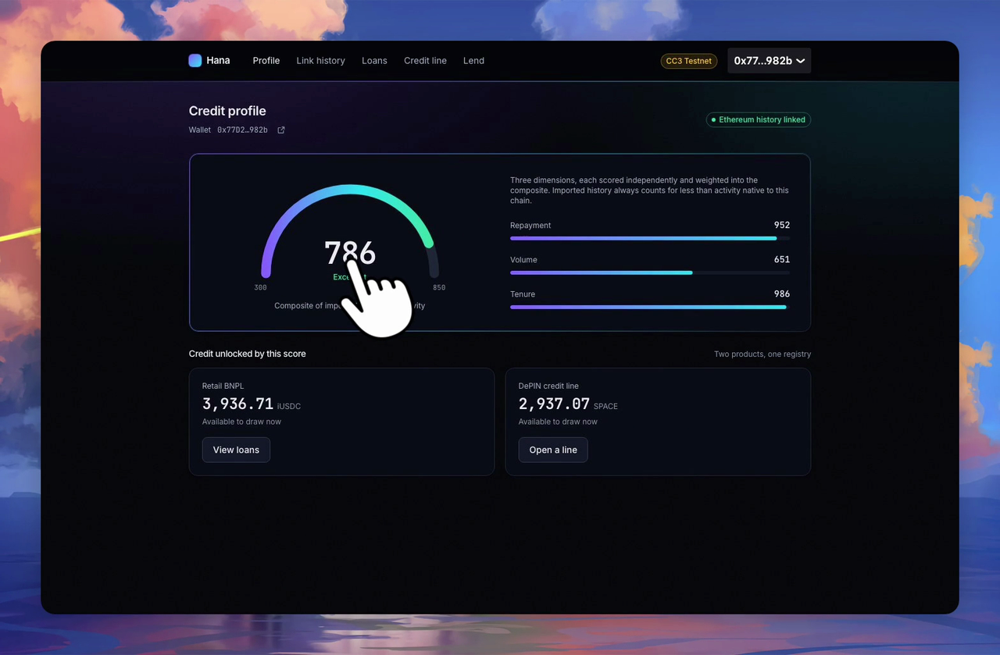
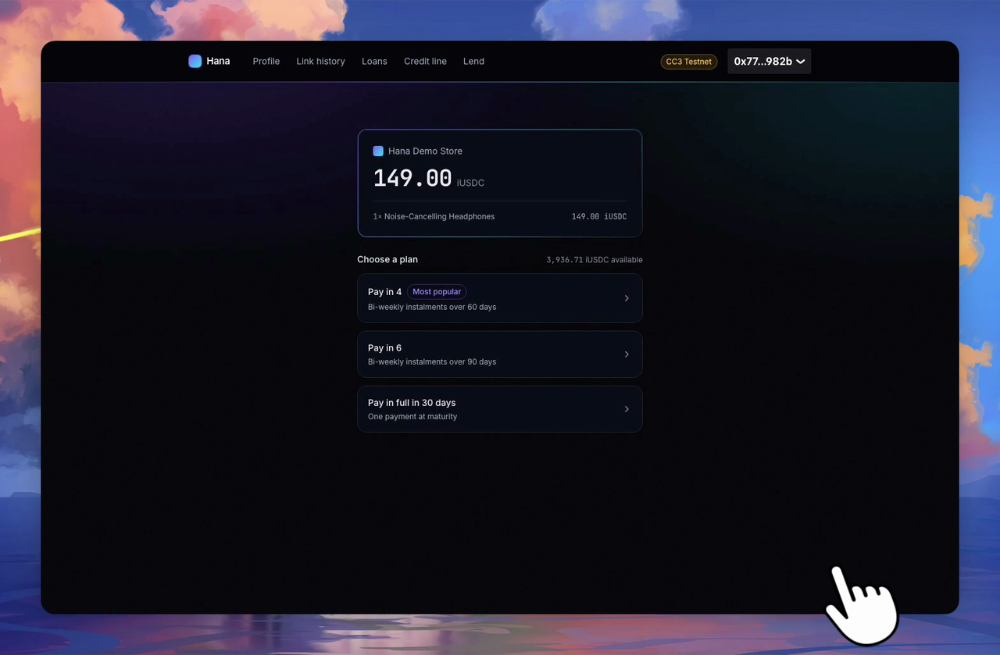
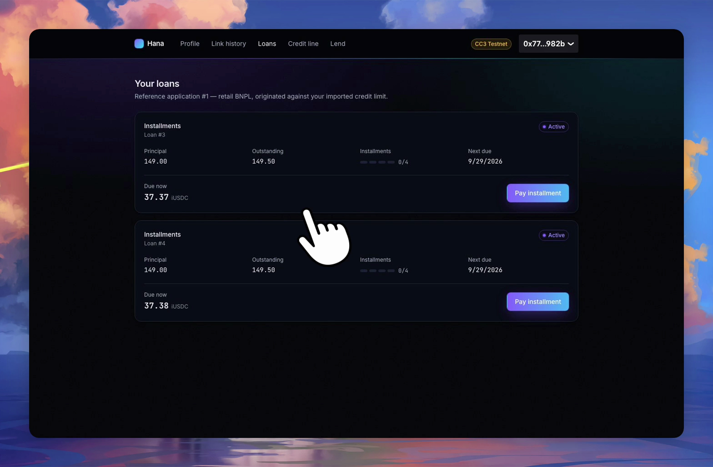
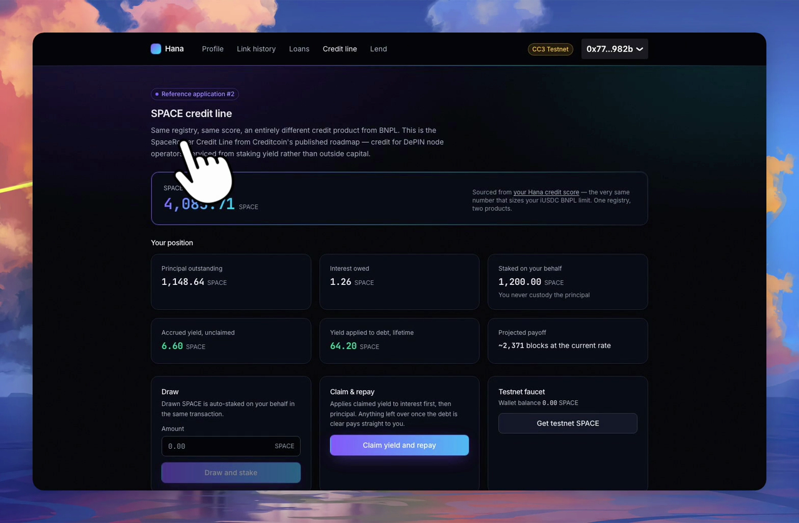
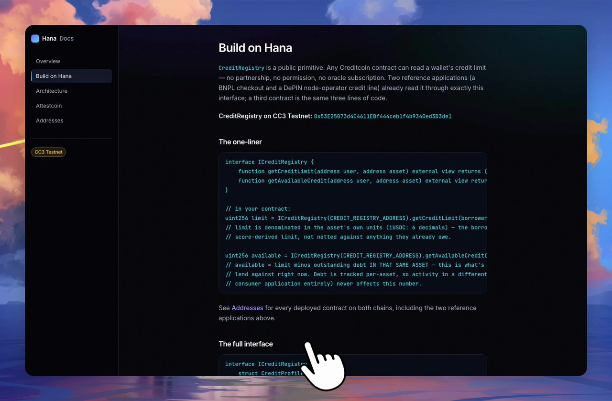

<div align="center">

# Hana Network

### Credit history that travels with the borrower.

**A cross-chain credit primitive on Creditcoin.** Import a wallet's lending record from another
chain — verified on-chain by a Merkle inclusion proof plus a continuity proof, not an oracle — and
read it from any contract with a single view call.

[](https://creditcoin-testnet.blockscout.com)
[](https://sepolia.etherscan.io)
[](#quick-start)
[](#live-deployments)
[](https://youtu.be/cf6tR-WRd1Y?si=dRicQ9lsLKxdft7F)

<br>

<a href="https://youtu.be/cf6tR-WRd1Y?si=dRicQ9lsLKxdft7F">
  
</a>

**[▶ Watch the full demo on YouTube](https://youtu.be/cf6tR-WRd1Y?si=dRicQ9lsLKxdft7F)** — every contract call in it is a real,
signed transaction on CC3 Testnet.

</div>

---

## The problem

A wallet can spend years borrowing and repaying perfectly on Ethereum — a record that is public,
permanent and independently verifiable. The moment it touches another chain, it is a stranger
again. Not lower-rated. **Unknown.**

<p align="center"></p>

That is why on-chain credit is stuck at overcollateralisation. If a borrower must post more than
they borrow, they have not been given credit — they have made a deposit. And the three obvious
fixes each fail for a different reason:

| Approach | Why it fails |
|---|---|
| Sign a message claiming your history | A signature proves you control a key. It proves nothing about what that key ever did. |
| Bridge it | A bridge moves assets and asks you to trust a validator committee. Credit is not an asset. |
| Post it with an oracle | Reintroduces exactly the trusted intermediary the protocol was built to remove. |

Even once the history is portable it needs somewhere to live, and Creditcoin has no
permissionless, EVM-native place to put it. Credal proves on-chain credit works at scale, but it is
an institutional API you apply for — not a contract an arbitrary dApp can query.

---

## How it works

Hana does not ask anyone to vouch. It imports the record itself and has Creditcoin verify it
on-chain.

<p align="center"></p>

1. A wallet calls `snapshot()` on `HanaCreditAttestor` (Sepolia) — one event summarising its
   lending record.
2. A worker fetches a Merkle inclusion + continuity proof and submits it to `CreditImporterASC`
   on CC3.
3. `CreditImporterASC` verifies it against the **real `INativeQueryVerifier` precompile at
   `0x0FD2`**, decodes the proved transaction's receipt and logs on-chain with `EvmV1Decoder`
   (the precompile proves inclusion only — it never interprets content), and runs four ordered
   checks before writing anything: replay key, receipt status, emitter identity, monotonic nonce.
   **Each has a committed negative test.**
4. `CreditRegistry` recomputes the composite score — imported history always weighted below native
   activity — and the limit becomes readable by any contract on the chain.

No oracle signs off. No committee votes. Nothing custodial moves. What crosses is a proved claim
about past behaviour.

---

## Proof it's real, not a mockup

<p align="center"></p>

| | |
|---|---|
| **Imported credit score** | A real wallet moved **300 → 786** from an actual Sepolia history — not a test fixture |
| **Attestation latency** | **~9 minutes**, measured across **four** independent live round trips: 497s, 532s, 559s, 491s |
| **Contract tests** | **59/59 passing**, including a negative test for every import check |
| **Both chains** | Every contract **verified** — source published, not just deployed bytecode |

Three things we found by running against live infrastructure instead of mocks, and fixed:

- **The precompile's ABI was not what the docs implied.** A de-risking spike against the real
  network caught our `IAttestcoin.sol` interface guess being wrong *on every field* — before a
  single contract was built on top of it.
- **A real cross-asset accounting bug.** `CreditRegistry` tracked debt in one shared field, so an
  18-decimal SPACE draw could silently zero out a wallet's 6-decimal iUSDC credit. Caught by
  driving both reference apps from one wallet in sequence — something 55 passing tests never did.
  Fixed with per-asset debt, plus two regression tests that close exactly that gap.
- **USC v2's sub-15-second claim does not hold on CC3 Testnet.** We publish the full measured
  breakdown rather than the headline, and the product is built around the number we actually
  observed.

The worker was also killed mid-attestation and resumed correctly without double-submitting, and
the lender interface paid real, measured yield: 3,000 iUSDC deposited, redeemed for
**3,000.000047 iUSDC** after a real borrower's interest accrued.

---

## Two reference applications. One registry. Zero coupling.

A registry only its own app reads is plumbing. So Hana ships two, deliberately different in shape,
drawing on the **same** imported score.

<p align="center"></p>

### #1 — Retail Buy Now, Pay Later

A shopper splits a real purchase into instalments, funded by an ERC-4626 `LendingPool` that real
depositors earn yield from, and disbursed through a `SettlementVault`. Liquidation of non-`iUSDC`
collateral routes through a PenguinSwap-shaped router — the mainnet address drops in with one
owner call, no redeployment.

<p align="center"></p>

<p align="center">
  
  
</p>

### #2 — DePIN node-operator credit line

An operator draws `$SPACE` against the same score, it is auto-staked in the same transaction —
they never custody the principal — and the debt is repaid from staking yield instead of their own
capital.

<p align="center"></p>

This is the **SpaceRouter Credit Line** from Creditcoin's own published roadmap, marked not yet
live. It needs underwriting, underwriting needs a score, and a permissionless score is exactly
what did not exist. Hana ships that layer ahead of the product that will need it.

Both apps are just entries in `CreditRegistry.authorizedReporters` calling the same two functions.

---

## Build on Hana

<p align="center"></p>

```solidity
// any Creditcoin contract — no partnership, no permission, no oracle subscription
interface ICreditRegistry {
    function getCreditLimit(address user, address asset) external view returns (uint256);
    function getAvailableCredit(address user, address asset) external view returns (uint256);
}

uint256 limit = ICreditRegistry(CREDIT_REGISTRY).getCreditLimit(borrower, asset);
```

Reading costs nothing and requires no permission. Debt is tracked per asset, so activity in one
consumer application never suppresses another's limit. A third contract is the same three lines.

---

## Live deployments

**Creditcoin CC3 Testnet** (chainId `102031`) — [explorer](https://creditcoin-testnet.blockscout.com)

| Contract | Address |
|---|---|
| `IUSDC` | [`0xe517Ff9Db1111A9e81A34AD512E7dc438DdB0f4a`](https://creditcoin-testnet.blockscout.com/address/0xe517Ff9Db1111A9e81A34AD512E7dc438DdB0f4a#code) |
| `CreditRegistry` | [`0x53E25073d4C4611EBf444ceb1f4b9340ed3D3de1`](https://creditcoin-testnet.blockscout.com/address/0x53E25073d4C4611EBf444ceb1f4b9340ed3D3de1#code) |
| `LendingPool` | [`0xcB08F80fFF56C7110Eca231CafBCd2AdD5363a43`](https://creditcoin-testnet.blockscout.com/address/0xcB08F80fFF56C7110Eca231CafBCd2AdD5363a43#code) |
| `SettlementVault` | [`0xf817e4b94914b70C00e086F30d9924Fb60C7f271`](https://creditcoin-testnet.blockscout.com/address/0xf817e4b94914b70C00e086F30d9924Fb60C7f271#code) |
| `LoanManager` | [`0xf954359074B83d8EcE8CF5c266A9749208e30d7a`](https://creditcoin-testnet.blockscout.com/address/0xf954359074B83d8EcE8CF5c266A9749208e30d7a#code) |
| `CreditImporterASC` | [`0xF3154Fe52444b4F6f833eF1873E734f60f713259`](https://creditcoin-testnet.blockscout.com/address/0xF3154Fe52444b4F6f833eF1873E734f60f713259#code) |
| `MockSPACE` | [`0x95457A6F26a9170B7e54136C4Fd932Af92d1730d`](https://creditcoin-testnet.blockscout.com/address/0x95457A6F26a9170B7e54136C4Fd932Af92d1730d#code) |
| `MockSpaceStaking` | [`0x06d5357E532EB6973BB699b3B63E57039D0D9d85`](https://creditcoin-testnet.blockscout.com/address/0x06d5357E532EB6973BB699b3B63E57039D0D9d85#code) |
| `SpaceCreditLine` | [`0x65A38BfCB9a5741097aa78F1acAf5f05d3bC908E`](https://creditcoin-testnet.blockscout.com/address/0x65A38BfCB9a5741097aa78F1acAf5f05d3bC908E#code) |
| `MockPenguinSwapRouter` | [`0x2127CAdecd947df2B93b92E675820309b256f103`](https://creditcoin-testnet.blockscout.com/address/0x2127CAdecd947df2B93b92E675820309b256f103#code) |

_(`CreditRegistry`, `LoanManager`, `CreditImporterASC`, and `SpaceCreditLine` were each redeployed
more than once over the course of this pivot — first for the registry's `authorizedReporters`
change, again for PenguinSwap liquidation support, and again to partition `outstandingDebt` per
asset after live testing surfaced a real bug where an 18-decimal SPACE draw could zero out a
wallet's 6-decimal iUSDC available credit. `LendingPool`/`SettlementVault`/`IUSDC` kept their
original addresses throughout and were just re-pointed at each new `LoanManager` in turn.
`MockSPACE`, `MockSpaceStaking`, and `MockPenguinSwapRouter` are unchanged since they were first
deployed.)_

**Ethereum Sepolia** (chainId `11155111`) — the credit-import source chain

| Contract | Address |
|---|---|
| `HanaCreditAttestor` | [`0x89D15677c532eccDf5c8eBff69e38DB13ce966C5`](https://sepolia.etherscan.io/address/0x89D15677c532eccDf5c8eBff69e38DB13ce966C5#code) |

All six contracts are verified (source published, not just deployed). These are also the single
source of truth consumed by every package — see `packages/shared/src/generated/`; nothing hand-copies
an address.

---

## Chain facts

Confirmed live during the Phase 1 spike — not assumptions.

| | |
|---|---|
| Protocol chain | Creditcoin CC3 Testnet (EVM L1), chainId `102031` — RPC `https://rpc.cc3-testnet.creditcoin.network` |
| Source chain | Ethereum Sepolia, chainId `11155111` — `chainKey` **1** as seen by the CC3 USC runtime |
| Attestcoin verifier precompile | `0x0000000000000000000000000000000000000FD2` (proves Merkle inclusion + continuity only — does not decode the transaction) |
| Chain Info precompile | `0x0000000000000000000000000000000000000fd3` (a *different* precompile — `getSupportedChains()` lives here) |
| Prover | `https://prover.cc3-testnet.creditcoin.network` |
| Measured attestation latency | ~9 minutes, emit → confirmed import (**four** independent live measurements: 497s, 532s, 559s, 491s) |
| SDK | `@gluwa/usc-sdk` (peer dep: ethers v6) for off-chain proof fetching; `@gluwa/asc-contracts`'s `EvmV1Decoder` on-chain for decoding a proved transaction's receipt/logs |
| Primary asset | `iUSDC` (mock ERC20, 6 decimals, faucet-mintable) |

---

## Deploying (Vercel)

Four of the packages are Next.js apps and deploy cleanly to Vercel. **One Vercel project per app**,
each with its own **Root Directory** — this is a pnpm workspace, so do not point a project at the
repo root.

| Order | Vercel Root Directory | What it is | Environment needed |
|---|---|---|---|
| 1 | `hana-ctc-docs` | Protocol docs, Attestcoin write-up, live address book | **None** |
| 2 | `hana-ctc-merchant` | Merchant portal + bill API | `MONGODB_URI`, `MERCHANT_INTERNAL_TOKEN`, `CHECKOUT_BASE_URL`, `CC3_RPC_URL`, `SETTLEMENT_VAULT_DEPLOY_BLOCK` |
| 3 | `hana-ctc-checkout` | Checkout Hub — score, onboarding, loans, credit line | `NEXT_PUBLIC_CC3_RPC_URL`, `NEXT_PUBLIC_CC3_CHAIN_ID`, `NEXT_PUBLIC_SEPOLIA_RPC_URL`, `NEXT_PUBLIC_WALLETCONNECT_PROJECT_ID`, `NEXT_PUBLIC_WORKER_STATUS_URL`, `NEXT_PUBLIC_MERCHANT_API_URL`, `MERCHANT_INTERNAL_TOKEN` |
| 4 | `hana-ctc-store` | Demo storefront | `MERCHANT_API_URL`, `MERCHANT_CLIENT_ID`, `MERCHANT_CLIENT_SECRET` |

Vercel settings that matter for all four:

- **Framework preset** Next.js, **Install Command** `pnpm install` (run from the repo root so the
  workspace resolves), **Build Command** `pnpm build`.
- Enable **"Include source files outside of the Root Directory"** — every app imports
  `@hana/shared` for the generated address book and ABIs.

### Three things that will bite you

1. **`hana-ctc-worker` cannot go on Vercel.** It's a long-running listener that polls for
   attestation and keeps crash-safe job state on disk. Serverless functions are neither
   long-running nor persistent. Host it on Railway, Render or Fly, then point
   `NEXT_PUBLIC_WORKER_STATUS_URL` at that public HTTPS URL. Without it, the checkout's
   "Link Ethereum history" flow has nothing to poll.
2. **The merchant needs a real MongoDB.** The local `db:memory` helper is an in-process server —
   fine for a laptop, meaningless on Vercel. Use MongoDB Atlas (the free tier is enough) and put
   its connection string in `MONGODB_URI`.
3. **Get a real WalletConnect project ID.** The placeholder returns `403` from
   `cloud.reown.com` and RainbowKit's wallet list degrades. It's free at
   [cloud.reown.com](https://cloud.reown.com), and the deployed origin must be added to its
   allowlist.

Deploy in the order above: docs has no dependencies, the merchant must exist before the store and
checkout can be pointed at it.
---

## Monorepo layout

| Folder | Package | Role | Status |
|---|---|---|---|
| [`hana-ctc-contracts/`](./hana-ctc-contracts) | `@hana/contracts` | Core protocol on CC3: `CreditRegistry`, `LendingPool`, `LoanManager`, `SettlementVault`, `CreditImporterASC`, `iUSDC` | Deployed + verified |
| [`hana-ctc-attestor/`](./hana-ctc-attestor) | `@hana/attestor` | `HanaCreditAttestor` on Ethereum Sepolia (source chain) | Deployed + verified |
| [`hana-ctc-worker/`](./hana-ctc-worker) | `@hana/worker` | Off-chain orchestrator: event → attest wait → proof → ASC submit | Built + proven live |
| [`hana-ctc-checkout/`](./hana-ctc-checkout) | `@hana/checkout` | Checkout Hub: wallet, score, credit-import onboarding, loans, repayment | Built + proven live |
| [`hana-ctc-merchant/`](./hana-ctc-merchant) | `@hana/merchant` | Merchant portal + bill API (MongoDB) | Built + tested |
| [`hana-ctc-store/`](./hana-ctc-store) | `@hana/store` | Demo storefront ("Pay with Hana") | Built + proven live |
| [`hana-ctc-docs/`](./hana-ctc-docs) | `@hana/docs` | Protocol docs + Attestcoin write-up | Built + proven live |
| [`packages/shared/`](./packages/shared) | `@hana/shared` | Chain config, generated ABIs + address book, shared types | Live |

Each package's own `README.md` has a "design notes" section documenting the non-obvious decisions
and the real bugs found while building it.

---

## Quick start

```bash
pnpm install
cp .env.example .env            # then fill each package's own .env — see each package's README

# Contracts + attestor are already deployed (addresses above); to redeploy from scratch:
pnpm contracts:test              # protocol unit + integration tests (59/59 passing)
pnpm attestor:test                # 7/7 passing
pnpm attestor:deploy:sepolia && pnpm attestor:verify:sepolia
pnpm contracts:deploy:cc3 && pnpm contracts:deploy:importer:cc3 && pnpm contracts:deploy:spacecreditline:cc3 && pnpm contracts:deploy:penguinswap:cc3 && pnpm contracts:verify:cc3
pnpm sync:abis                   # publish addresses + ABIs to @hana/shared

pnpm worker:dev                  # http://localhost:8787

# Merchant needs a MongoDB — zero-setup local option, no Docker/account needed:
pnpm --filter @hana/merchant db:memory     # separate terminal, prints MONGODB_URI to copy in
pnpm merchant:dev                # http://localhost:3002

pnpm checkout:dev                # http://localhost:3001 — includes /lend
pnpm store:dev                   # http://localhost:3003 — needs its own merchant account, see hana-ctc-store/README.md
pnpm docs:dev                    # http://localhost:3004 — architecture, Attestcoin write-up, addresses, integration guide
```

Each package's own `README.md` has the full environment variable list and exact commands
(`pnpm typecheck`, `pnpm build`, package-specific scripts).

