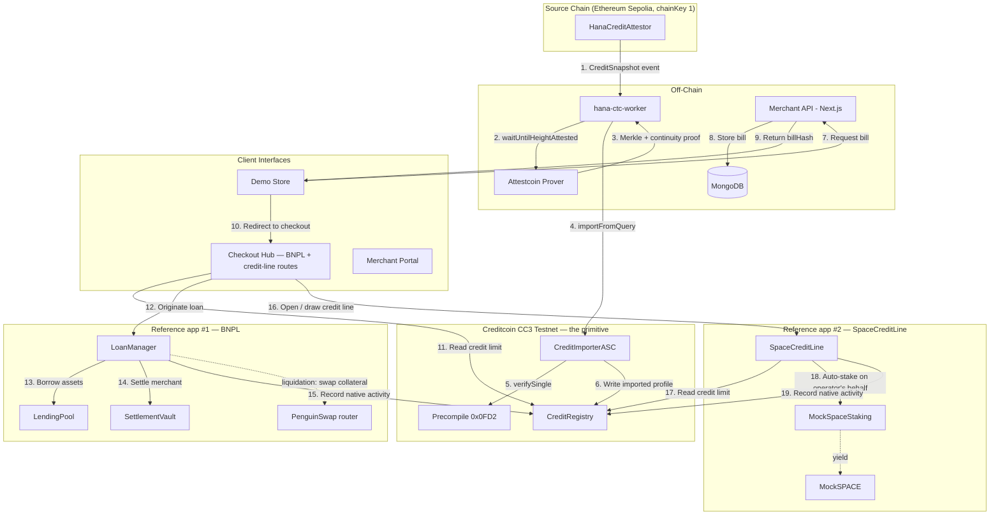

# Hana Network (Creditcoin): System Architecture

## 1. High-Level Architecture

Hana spans four layers: the **Source Chain**, the **Attestation Layer**, the **Creditcoin Protocol**,
and the **Client Interfaces**. `CreditRegistry` sits at the center of the Creditcoin Protocol layer
as a shared primitive — the diagram below deliberately shows **two independent consumer
applications** (`LoanManager` for BNPL, `SpaceCreditLine` for the DePIN credit line) both reading
and writing it through the exact same two-function surface, with zero edges between the two
applications themselves.



Steps 11/17 and 15/19 are the same two `ICreditRegistry` calls (`getCreditLimit`,
`recordNativeActivity`) made by two unrelated contracts — `CreditRegistry.authorizedReporters`
governs who may call the write path, and both `LoanManager` and `SpaceCreditLine` are authorized
independently of each other.

---

## 2. Component Details

### 2.1 Source-Chain Contract (Solidity, Sepolia)

**`HanaCreditAttestor`** reads a user's local lending history and emits a single aggregated event:

```solidity
event CreditSnapshot(
    address indexed subject,
    uint64  loansCompleted,
    uint64  onTimePayments,
    uint64  latePayments,
    uint64  defaults,
    uint128 cumulativeBorrowedWei,
    uint64  firstActivityTimestamp,
    uint64  snapshotNonce          // monotonic, for replay protection + freshness
);
```

**Why one summary event instead of proving individual transactions:** batch proofs cap at 10 transactions within a 1000-block range. A user with 40 repayments spread across a year cannot be imported transaction-by-transaction. Aggregating into one event turns an unbounded, latency-sensitive import into a bounded, one-shot operation.

### 2.2 The Worker (`hana-ctc-worker`)

Node.js service using `@gluwa/usc-sdk` and ethers v6. Responsibilities:
* Subscribe to `CreditSnapshot` events on the source chain.
* Call `waitUntilHeightAttested` until the containing block is attested on Creditcoin (polls at 15s intervals).
* Retrieve the Merkle inclusion proof and continuity proof from the prover.
* Submit `importFromQuery` to `CreditImporterASC` on Creditcoin.
* Retry with backoff, dedupe in-flight imports, and surface pending state to the frontend.

### 2.3 Creditcoin Contracts (Solidity)

* **`CreditImporterASC`:** Verifies attested proofs via precompile `0x0FD2`, decodes the `CreditSnapshot` log, applies the four security checks, and writes to `CreditRegistry`. Uses the **separated ASC pattern** — distinct from business logic, keeping `CreditRegistry` reusable.
* **`CreditRegistry`:** The public credit primitive. Maintains multi-dimensional credit profiles and exposes `getCreditLimit(address, asset)` for any Creditcoin dApp.
* **`LendingPool`:** Manages protocol liquidity, issues ERC20 LP shares, and applies a kinked utilization curve to set borrower rates.
* **`LoanManager`:** Loan controller. Handles origination, repayment, completion, and liquidation across all four loan types. Calls `LendingPool` for assets and `CreditRegistry` to verify limits and record history.
* **`SettlementVault`:** Holds merchant settlements under time-locked or conditional release.

### 2.4 The Service Layer (Merchant API)

* **Role:** Bridge between traditional web stores and the protocol.
* **Authentication:** `x-client-id` and `x-client-secret` headers.
* **Persistence:** MongoDB maps unique `billHash` values to payment requirements (amount, merchant address, chain identifiers).

### 2.5 The Checkout Hub (`hana-ctc-checkout`)

* **Role:** Standalone application handling wallet connection and transaction signing, so merchants never touch user keys.
* **Stack:** Next.js, wagmi + viem + RainbowKit.
* **Adds:** the "Link your history" credit-import onboarding flow with a pending state.

---

## 3. Data Strategy

### 3.1 On-Chain State

```solidity
struct CreditProfile {
    uint16  compositeScore;       // 300–850
    uint16  repaymentScore;       // 0–1000
    uint16  volumeScore;
    uint16  tenureScore;
    uint64  nativeLoansCompleted;
    uint64  lastImportNonce;
    uint64  lastUpdated;
    bool    hasImportedHistory;
}

mapping(address => CreditProfile) public profiles;
mapping(uint64 => mapping(address => uint64)) public importNonces;  // chainKey => subject => nonce
mapping(uint256 => Loan) public loans;
mapping(address => uint256[]) public userLoans;
mapping(bytes32 => bool) public consumedProofs;                     // replay protection
```

Two write paths into `CreditRegistry`, strictly separated:
* `recordNativeActivity(...)` — `onlyLoanManager`, for loans originated on Creditcoin.
* `importAttestedHistory(...)` — `onlyImporterASC`, for verified cross-chain snapshots.

### 3.2 Off-Chain Metadata

Financial state lives on-chain. Rich metadata — product descriptions, images, merchant branding — is stored in the Merchant API's MongoDB and retrieved via `billHash`.

---

## 4. Interaction Flows

### 4.1 Cross-Chain Credit Import (Onboarding)
1. User connects their wallet in the Checkout Hub and selects "Link your Ethereum history."
2. User signs one transaction on Sepolia calling `HanaCreditAttestor`, which emits `CreditSnapshot`.
3. The worker detects the event and calls `waitUntilHeightAttested` for the containing block.
4. Once attested, the worker fetches the Merkle inclusion and continuity proofs from the prover.
5. The worker calls `CreditImporterASC.importFromQuery(...)` on Creditcoin.
6. The ASC verifies via precompile `0x0FD2`, checks receipt status, emitter address, replay key, and nonce monotonicity.
7. `CreditRegistry` updates the profile; the UI transitions from pending to the new score.

### 4.2 Loan Initiation
1. Merchant calls `POST /api/bills/create` with the purchase amount.
2. The API returns a `checkoutUrl` containing a `billHash`.
3. User is redirected to the Checkout Hub.
4. The Hub reads the user's credit limit from `CreditRegistry` — a single local `view` call, instant.
5. User selects an installment plan (e.g. 4 payments).
6. User signs a transaction that originates the loan in `LoanManager`, which draws principal from `LendingPool`, routes settlement to `SettlementVault`, and records the new liability in `CreditRegistry`.

### 4.3 Repayment
1. User visits the Checkout Hub dashboard.
2. User approves and transfers the installment amount.
3. `LoanManager.makePayment` verifies the amount, forwards principal and interest to `LendingPool`, and updates on-time/late counters in `CreditRegistry`.

### 4.4 Third-Party Integration
Any Creditcoin contract can underwrite against Hana's credit graph with a single call:

```solidity
uint256 limit = ICreditRegistry(HANA_REGISTRY).getCreditLimit(user, asset);
```

No attestation infrastructure, no oracle subscription, no permission required.
